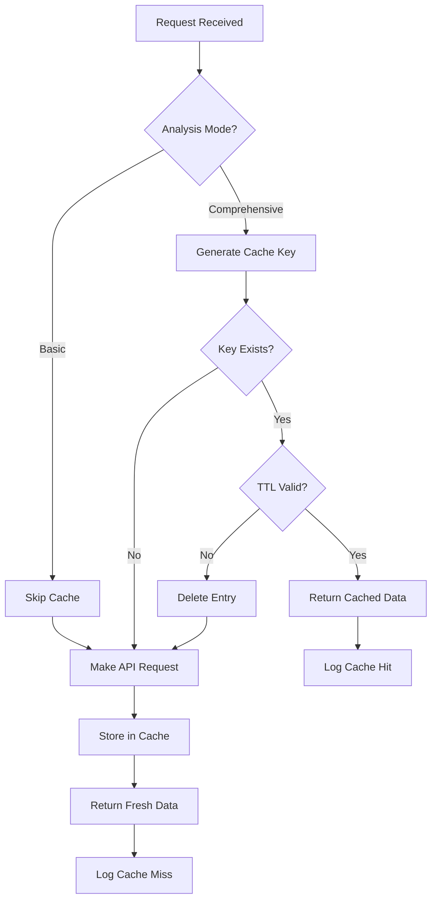

## Overview

Grok Search MCP Server implements an intelligent in-memory caching system specifically designed for comprehensive analysis queries. This cache improves performance, reduces API costs, and provides faster responses for repeated complex analyses.

## Cache Implementation

The caching system is implemented in the `SearchCache` class:

```javascript
// index.js:36-70
class SearchCache {
  constructor(maxSize = 100, ttlMinutes = 30) {
    this.cache = new Map();
    this.maxSize = maxSize;
    this.ttl = ttlMinutes * 60 * 1000;
  }

  get(key) {
    const item = this.cache.get(key);
    if (!item) return null;
    
    if (Date.now() - item.timestamp > this.ttl) {
      this.cache.delete(key);
      return null;
    }
    
    return item.data;
  }

  set(key, data) {
    if (this.cache.size >= this.maxSize) {
      const firstKey = this.cache.keys().next().value;
      this.cache.delete(firstKey);
    }
    
    this.cache.set(key, {
      data,
      timestamp: Date.now()
    });
  }

  clear() {
    this.cache.clear();
  }
}
```

## Cache Configuration

<CardGroup cols={2}>
  <Card title="Default Max Size" icon="database">
    **100 items**
    
    Maximum number of cached comprehensive analyses
  </Card>
  <Card title="Default TTL" icon="clock">
    **30 minutes**
    
    Time-to-live before cache entries expire
  </Card>
</CardGroup>

## How Caching Works

### 1. Cache Key Generation

Cache keys include all parameters to ensure accuracy:

```javascript
// index.js:210-217
if (analysisMode === "comprehensive") {
  const cacheKey = `${sanitizedQuery}:${searchType}:${maxResults}:${JSON.stringify(handles)}:${fromDate}:${toDate}:comprehensive`;
  const cached = this.cache.get(cacheKey);
  if (cached) {
    Logger.debug("Cache hit for comprehensive analysis", { query: sanitizedQuery });
    return cached;
  }
}
```

**Cache Key Components**:
- Sanitized query text
- Search type (web/news/twitter/general)
- Max results parameter
- Handle array (for Twitter searches)
- From date (if specified)
- To date (if specified)
- Analysis mode marker ("comprehensive")

### 2. Cache Check (Read)

Before making an API request, the system checks the cache:

<Steps>
  <Step title="Key Lookup">
    System generates cache key from request parameters
  </Step>
  <Step title="Existence Check">
    Looks up key in the Map data structure
  </Step>
  <Step title="TTL Validation">
    Checks if cached item is still within the 30-minute TTL
  </Step>
  <Step title="Return or Continue">
    Returns cached data if valid, or proceeds to API call if not
  </Step>
</Steps>

### 3. Cache Storage (Write)

After successful comprehensive analysis, results are cached:

```javascript
// index.js:272-276
if (analysisMode === "comprehensive" && results) {
  const cacheKey = `${sanitizedQuery}:${searchType}:${maxResults}:${JSON.stringify(handles)}:${fromDate}:${toDate}:comprehensive`;
  this.cache.set(cacheKey, results);
}
```

### 4. LRU Eviction

When cache reaches capacity, the **Least Recently Used** item is removed:

```javascript
set(key, data) {
  if (this.cache.size >= this.maxSize) {
    const firstKey = this.cache.keys().next().value;
    this.cache.delete(firstKey);
  }
  
  this.cache.set(key, {
    data,
    timestamp: Date.now()
  });
}
```

## What Gets Cached

<Tabs>
  <Tab title="Cached">
    ### Comprehensive Analyses Only

    The cache **only** stores comprehensive analysis results:

    ✅ **Cached Requests**:
    ```json
    {
      "tool": "grok_search",
      "parameters": {
        "query": "AI developments 2025",
        "analysis_mode": "comprehensive"
      }
    }
    ```

    ✅ **Full Response Cached**:
    - Comprehensive analysis text
    - Key findings array
    - Timeline events
    - Direct quotes
    - Multiple perspectives
    - Implications
    - Verification status
    - Raw results
    - Citations and metadata

    ### Why Only Comprehensive?

    <Info>
    Comprehensive analyses are expensive operations (4000 tokens vs 2000) and results remain relevant longer than basic search results which prioritize real-time data.
    </Info>
  </Tab>

  <Tab title="Not Cached">
    ### Basic Mode Searches

    Basic searches are **never** cached:

    ❌ **Not Cached**:
    ```json
    {
      "tool": "grok_search",
      "parameters": {
        "query": "latest news",
        "analysis_mode": "basic"
      }
    }
    ```

    ### Why Not Cache Basic?

    <Warning>
    Basic searches prioritize real-time, up-to-date information. Caching would defeat the purpose of quick, current results.
    </Warning>

    **Design Rationale**:
    - Basic mode emphasizes freshness
    - Lower token cost makes repeated queries acceptable
    - Use cases often require real-time data
    - Simpler response structure processes quickly
  </Tab>
</Tabs>

## Cache Lifecycle



## Monitoring Cache Performance

The health check tool provides cache metrics:

```json
{
  "tool": "health_check",
  "parameters": {}
}
```

**Response includes cache size**:
```json
{
  "server_healthy": true,
  "api_healthy": true,
  "api_details": {
    "hasApiKey": true,
    "cacheSize": 42,
    "lastError": null
  }
}
```

## Cache Key Examples

### Example 1: Simple Query
```javascript
// Request
{
  query: "climate change",
  searchType: "news",
  maxResults: 10,
  analysisMode: "comprehensive"
}

// Cache Key
"climate change:news:10:undefined:undefined:undefined:comprehensive"
```

### Example 2: With Date Range
```javascript
// Request
{
  query: "tech earnings",
  searchType: "news",
  maxResults: 15,
  fromDate: "2025-03-01",
  toDate: "2025-03-04",
  analysisMode: "comprehensive"
}

// Cache Key
"tech earnings:news:15:undefined:2025-03-01:2025-03-04:comprehensive"
```

### Example 3: Twitter with Handles
```javascript
// Request
{
  query: "AI announcements",
  searchType: "twitter",
  handles: ["OpenAI", "AnthropicAI"],
  maxResults: 20,
  analysisMode: "comprehensive"
}

// Cache Key
"AI announcements:twitter:20:[\"OpenAI\",\"AnthropicAI\"]:undefined:undefined:comprehensive"
```

## Performance Impact

<CardGroup cols={3}>
  <Card title="Cache Hit" icon="gauge-high">
    **< 10ms**
    
    Instant response from memory
  </Card>
  <Card title="Cache Miss" icon="gauge-simple">
    **10-20 seconds**
    
    Full API request required
  </Card>
  <Card title="Token Savings" icon="piggy-bank">
    **4,000 tokens**
    
    Saved per cache hit
  </Card>
</CardGroup>

## Best Practices

### For Developers

<AccordionGroup>
  <Accordion title="Use Consistent Parameters">
    Keep parameters consistent for the same query to maximize cache hits:

    ✅ **Good**: Same query, same parameters
    ```json
    // First request
    {"query": "AI trends", "max_results": 10, "analysis_mode": "comprehensive"}
    
    // Second request (cache hit)
    {"query": "AI trends", "max_results": 10, "analysis_mode": "comprehensive"}
    ```

    ❌ **Bad**: Varying parameters prevents cache hits
    ```json
    // First request
    {"query": "AI trends", "max_results": 10, "analysis_mode": "comprehensive"}
    
    // Second request (cache miss)
    {"query": "AI trends", "max_results": 15, "analysis_mode": "comprehensive"}
    ```
  </Accordion>

  <Accordion title="Understand TTL Limitations">
    Cache entries expire after 30 minutes:

    - For topics changing rapidly, consider basic mode instead
    - For research queries, cache provides excellent reusability
    - Breaking news may be stale after 30 minutes
  </Accordion>

  <Accordion title="Monitor Cache Size">
    Maximum 100 entries with LRU eviction:

    - Popular queries remain cached longer
    - Unique queries may be evicted quickly
    - Use health_check to monitor cache size
  </Accordion>

  <Accordion title="Query Normalization">
    Be aware that query text must match exactly:

    ```javascript
    // These are different cache keys
    "climate change"  !== "Climate Change"
    "AI trends "      !== "AI trends"  // trailing space
    ```

    The server sanitizes control characters but preserves case and spacing.
  </Accordion>
</AccordionGroup>

## Cache Limitations

<Warning>
**Cache Invalidation**: There is no automatic cache invalidation when source data changes. Entries remain cached for the full 30-minute TTL regardless of updates to source content.
</Warning>

<Note>
**Memory Only**: Cache is stored in-memory and does not persist across server restarts. Restarting the MCP server clears all cached entries.
</Note>

## Advanced: Manual Cache Management

While not exposed through the MCP interface, the cache can be cleared programmatically:

```javascript
// In server code
this.grokAPI.cache.clear();
```

This might be useful for:
- Development and testing
- Forcing fresh data retrieval
- Memory management in constrained environments

## Summary

The intelligent caching system:

1. **Targets expensive operations** - Only caches comprehensive analyses
2. **Uses precise keys** - Includes all parameters for accuracy
3. **Implements TTL** - 30-minute expiration ensures reasonable freshness
4. **Employs LRU eviction** - Maintains 100-item capacity efficiently
5. **Transparent operation** - Works automatically without configuration
6. **Performance boost** - Reduces latency from 10-20s to under 10ms on cache hits
7. **Cost optimization** - Saves 4,000 tokens per cached comprehensive analysis

<Tip>
For repeated comprehensive analyses of the same topic within 30 minutes, the cache provides dramatic performance improvements and cost savings.
</Tip>